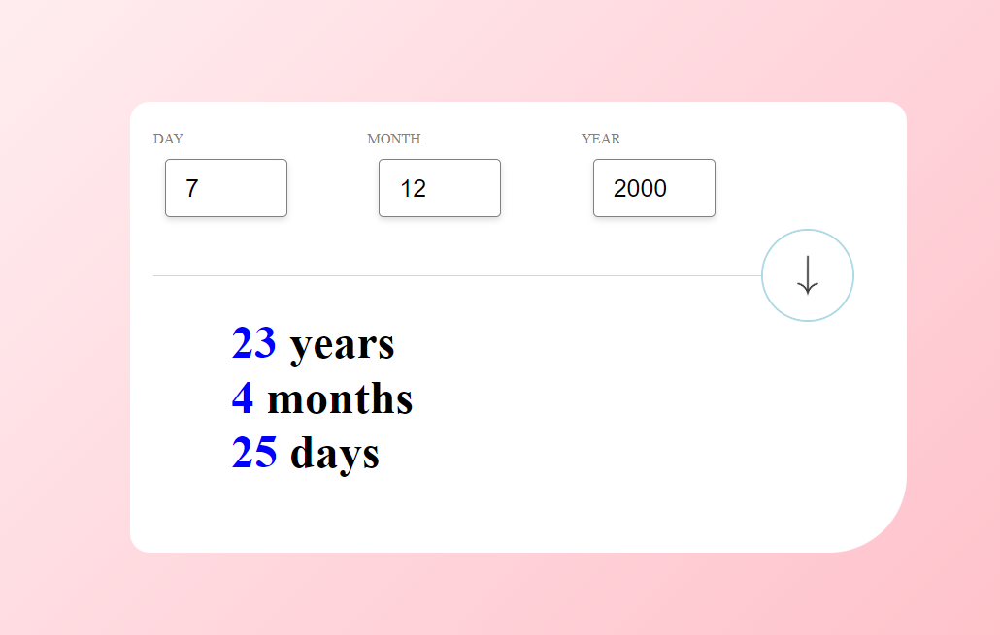

# React + Vite

This template provides a minimal setup to get React working in Vite with HMR and some ESLint rules.

Currently, two official plugins are available:

- [@vitejs/plugin-react](https://github.com/vitejs/vite-plugin-react/blob/main/packages/plugin-react/README.md) uses [Babel](https://babeljs.io/) for Fast Refresh
- [@vitejs/plugin-react-swc](https://github.com/vitejs/vite-plugin-react-swc) uses [SWC](https://swc.rs/) for Fast Refresh

𝗔𝘀𝘀𝗲𝘁𝘀 𝗖𝗼𝗺𝗽𝗼𝗻𝗲𝗻𝘁
 The Assests Component, that allows users to input their birth date and calculates their current age in years,months and days.

𝗜𝗻𝘀𝘁𝗮𝗹𝗹𝗮𝘁𝗶𝗼𝗻
 To use the Age Calculator in your React project, you can follow these steps:

 1.Install the component from NPM:
   npm install assets

 2.Import the component into your React application:
   import Edit from "assets/Edit/Edit";

 3.Use the <Edit/> component in your JSX:
   <Edit />

𝗨𝘀𝗮𝗴𝗲
  The Assets Component consists of input fields for day, month, and year. After entering the birth date, it displays the calculated age in years, months, and days.

𝗘𝘅𝗮𝗺𝗽𝗹𝗲
 import React from "react";
import Edit from "assets/Edit/Edit";

const App = () => {
  return (
    

      <h1>Age Calculator</h1>
      <Hero />
    

  );
};

export default App;

𝗙𝗲𝗮𝘁𝘂𝗿𝗲𝘀
 1.Allows users to input their birth date.
 2.Calculates and displays the current age in years, months, and days.
 3.Validates the input fields to ensure a valid date is entered.
 4.Error messages are displayed for invalid input.

𝗣𝗿𝗼𝗽𝘀
 The Assets Component does not currently accept any props.

𝗗𝗲𝘃𝗲𝗹𝗼𝗽𝗺𝗲𝗻𝘁
 If you want to contribute to the development of the Assets Component, you can fork the repository from GitHub ( https://github.com/PrakashPurane/Age-Calculator ) and submit pull requests.

𝗟𝗶𝗰𝗲𝗻𝘀𝗲
 This project is licensed under the MIT License - see the LICENSE file for details.

